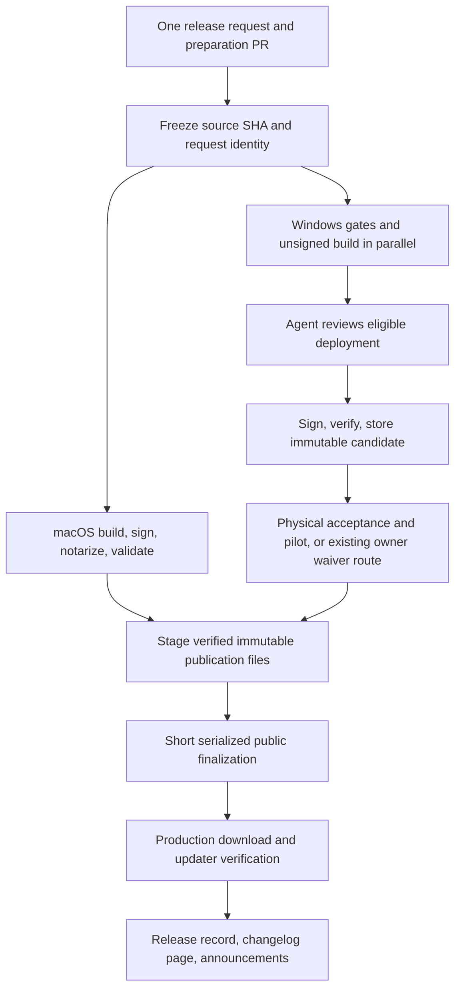

# Plan 066: Make desktop releases fast, agent-operated, and resumable

> **Executor instructions:** Implement the slices in order, preserving the
> candidate/signing/publication trust boundaries. This is a plan, not authority
> to ship a version, approve a currently running deployment, or cancel existing
> runs. A subsequent release instruction authorizes those actions for its exact
> release. Update this plan and its index entry as slices land.

## Status and baseline

- **Status:** IMPLEMENTED and locally reviewed on
  `feat/066-fast-resumable-releases`; PR delivery is pending. Production cutover
  remains disabled. Protected-main rehearsals and infrastructure readiness are
  outstanding rollout gates, not completed implementation evidence.
- **Priority:** P1. **Effort:** L overall; S0 is a small independently useful fix.
- **Risk:** HIGH for source identity, cancellation, and publication; MED for caching.
- **Depends on:** no other plan. Preserve the existing Windows acceptance policy.
- **Investigated:** 2026-09-26, using read-only GitHub APIs, job logs, source, and docs.
- **Local HEAD:** `15206746ac1d6fcc231e881c077b8781e3fb32d6`.
- **Current source inspected:** GitHub main
  `f0e57b320c9f6a9fcc02369a81b222f1c0487d01`.
- **Scope:** Windows is the priority; macOS coordination and shared publication
  are included. Linux compatibility is required where helpers are shared, but
  Linux release/acceptance redesign is outside this plan.

**Drift check:** Start a clean worktree from current main. Do not implement from
the older checkout in which this plan was written. Run:

```sh
git diff --stat f0e57b320c9f6a9fcc02369a81b222f1c0487d01..HEAD -- \
  .github/workflows .agents/skills/videorc-release scripts package.json \
  docs/releases docs/acceptance/windows-alpha
```

Compare changes with the evidence below; adapt to fixes already merged before
implementing. Do not overwrite the user's existing uncommitted plans/index.

## What should change

One release instruction should prepare a version once, start eligible platform
builds together, approve its own eligible Windows deployments, and resume from
verified checkpoints after interruption. New requests must not wait for an old
candidate's approval. Ordinary development on main must not invalidate frozen
release bytes. Only the brief public-pointer update needs global serialization.

Keep existing signing, hashes, updater ordering, acceptance, and artifact checks.
The GitHub approval click is distinct from physical acceptance. Agent approval
does not manufacture a PASS or authorize the agent to write an owner waiver.

## Findings: the hours are primarily waiting and wasted builds

All times below are UTC and snapshots from the investigation. These are observed
runs, not a representative percentile study. Candidate completion is not public
release completion.

| Run                                                                          | Evidence                                                                                                  | Result                                                                      |
| ---------------------------------------------------------------------------- | --------------------------------------------------------------------------------------------------------- | --------------------------------------------------------------------------- |
| [36014186508](https://github.com/TheOrcDev/videorc/actions/runs/36014186508) | Sept 24 unsigned job 14:38:12–15:23:31; signing job had no executed steps before cancellation at 21:24:01 | About 45m build, then 6h waiting; total 6h46m                               |
| [36031633371](https://github.com/TheOrcDev/videorc/actions/runs/36031633371) | Requested Sept 24 at 17:03:26; cancelled at 21:24:03 without build steps                                  | A newer candidate spent about 4h20m behind the old candidate                |
| [36061252925](https://github.com/TheOrcDev/videorc/actions/runs/36061252925) | Requested Sept 24 at 21:24:16; unsigned job 52m; inter-job gap 1m03s; signing job 6m13s                   | Successful signed private candidate in 59m22s                               |
| [36201722598](https://github.com/TheOrcDev/videorc/actions/runs/36201722598) | Unsigned job Sept 25 23:37:19–Sept 26 00:22:18; signing began 18:57:23                                    | 44m59s build, 18h35m05s gap; failed in the post-approval current-main check |
| [36269866742](https://github.com/TheOrcDev/videorc/actions/runs/36269866742) | Requested Sept 26 20:32:16; unsigned job began 20:51:49 after the preceding run was cancelled             | Another 19m33s before build start; was still running when inspected         |

The logs for 36201722598 show Rust test compilation taking **21m54s**, actual
backend tests **128.58s**, Clippy **1m32s**, and release compilation **8m35s**.
Its combined source/unit step took 28m23s; packaging took 14m34s. Optimizing
compilation is justified; removing the test assertions is not.

### Vetted priorities

| Finding                                                                    | Impact                                                                         | Effort | Fix risk | Confidence / evidence at inspected main                                      |
| -------------------------------------------------------------------------- | ------------------------------------------------------------------------------ | ------ | -------- | ---------------------------------------------------------------------------- |
| Whole candidate workflow holds one non-cancelling slot through approval    | Hours of head-of-line blocking                                                 | M      | MED      | HIGH: `release-windows-alpha.yml:11`, observed runs above                    |
| Human-only approval instructions despite eligible agent identity           | Agent stops at an avoidable click                                              | S      | MED      | HIGH: environment API; skill checkpoint and escalation rules                 |
| Moving-main equality checked again after building                          | Completed builds become unusable after unrelated merges                        | M      | HIGH     | HIGH: candidate workflow sign check; failed run above                        |
| Candidate release lane lacks Cargo caching                                 | Repeated cold test/release compilations                                        | S–M    | MED      | HIGH: candidate workflow vs `windows.yml` Rust cache; compile logs           |
| Skill starts Windows after macOS finishes, with another preparation PR     | Platform durations add together                                                | M      | MED      | HIGH: current skill around lines 215 and 265                                 |
| Promotion compares candidate version to tooling checkout version           | Later version bump can strand accepted bytes                                   | M      | HIGH     | HIGH: `windows-release-publication.mjs:34`, uploader `:42–44,90`             |
| Shared publication lock covers preparation but excludes local macOS upload | Excess waits plus possible concurrent shared-state writes                      | L      | HIGH     | HIGH: promotion workflow `:31`; skill `:157`; Windows mutable PUT `:161–180` |
| Recovery state lives in a runner's `dist/`                                 | Lost mirror recovery on fresh runners; local releases blocked by stale records | M      | MED      | HIGH: `release-upload-origins.mjs:183–215,255–261`                           |
| Changelog filtering selects platform, not exact release                    | Future/abandoned same-platform notes can go public                             | S–M    | MED      | HIGH: `changelog.mjs:165–195`; Windows uploader `:133–145`                   |

### Current configuration matters

The `windows-alpha-release` environment currently requires `TheOrcDev`, has
`prevent_self_review: false`, and allows protected branches. The authenticated
CLI user in this investigation is `TheOrcDev`. GitHub approval history confirms
that identity approved run 36201722598. This supports normal API review by the
release agent using the authorized user session; a live eligible deployment's
`current_user_can_approve` must still be checked. No approval was submitted here.

Main is protected by the active **Require PRs for main** ruleset, not classic
branch protection. Its effective rules require a PR and prohibit deletion and
non-fast-forward updates; the inspected rules did **not** require successful CI
checks or approving PR reviews. Do not equate “merged to main” with “all gates
passed.” The release controller must verify its named checks explicitly.

GitHub concurrency is not a reliable FIFO release queue: by default a concurrency
group retains one running and one pending entry and a newer pending entry can
replace the older one. See [GitHub concurrency](https://docs.github.com/en/actions/concepts/workflows-and-actions/concurrency).

## Decisions

1. **Agent review through the existing GitHub API is the first fix.** Keep the
   environment and OIDC boundary. Update the skill's policy to allow the agent
   to approve the exact release the user requested after deterministic checks.
   Do not add an owner PAT to repository secrets or pretend `GITHUB_TOKEN` is
   the configured human reviewer. Removing reviewer protection entirely is not
   necessary to satisfy the request.
2. **Freeze an immutable source identity at release start.** Main can advance
   afterward. A newer release request can supersede an older request; an ordinary
   source or documentation merge cannot silently change the selected candidate.
3. **Build/test and signing are separate scheduling units.** Obsolete unsigned
   preparation is cancellable. Signing already in progress finishes or fails
   under a bound; completed bytes remain immutable and cannot publish if the
   request was superseded. Never cancel public pointer writes automatically.
4. **Start macOS and Windows together.** Prepare both changelog entries and the
   version in one release PR. Publish each independently when eligible. Record
   divergence explicitly if a platform needs a later corrective version.
5. **Use one durable release controller and one short publication lane.** Local
   macOS remains a supported build/signing host. Its public finalization must
   use the same enforced lane as Actions releases.
6. **Keep announcements after production verification.** Content drafting can
   happen during builds. Discord/blog failures do not trigger rebuilds.

## Intended flow and performance targets



Targets are engineering objectives to measure, not promised timings:

| Metric                            | Initial target                   | Measurement boundary                                                       |
| --------------------------------- | -------------------------------- | -------------------------------------------------------------------------- |
| Eligible deployment approval      | ≤30s while controller is running | Pending deployment first observed → approved                               |
| Obsolete unsigned work superseded | ≤2m                              | New authorized request → old preparation cancelled                         |
| Own workflow queue overhead       | ≤2m                              | Excludes documented GitHub runner-capacity outages; report that separately |
| Cold Windows private candidate    | ≤65m                             | Accepted request with eligible source → verified signed candidate          |
| Warm Windows private candidate    | ≤30m                             | Same boundary, valid caches; retain all required gates                     |
| Signing/validation/storage        | ≤10m                             | Signing job started → verified candidate stored; baseline 6m13s            |
| Public finalization lock          | Target ≤5m                       | All large immutable files staged beforehand                                |

Publish queue, runner allocation, approval, compilation, tests, packaging,
signing, upload, acceptance, and public verification durations separately.
Report cold/warm results separately. Three rehearsals qualify rollout; after
ten real releases report p50/p95 without claiming those samples prove a durable
SLO. Physical acceptance and macOS endurance requirements are additional time.

## Scope and implementation conventions

Use Node 24 ESM, pnpm 11.0.9, `node:test` and `node:assert/strict`; follow pure
helper/injected-transport patterns in
`scripts/lib/windows-release-publication.test.mjs` and
`scripts/lib/release-upload-s3.test.mjs`. Preserve stable error codes, e.g.:

```js
throw new WindowsReleasePublicationError(
  'update-version-regression',
  `Windows updater version ${nextVersion} must not replace newer ${currentVersion}.`
)
```

In scope:

- `.github/workflows/release-windows-alpha.yml`, `promote-windows-alpha.yml`,
  `windows.yml`, `ci.yml`, `release-macos.yml`, and narrowly scoped new release
  control/signing/finalization workflows.
- New `scripts/release.mjs`, `scripts/lib/release-controller.mjs`,
  `release-state.mjs`, `release-github.mjs`, `release-metrics.mjs` and their tests.
- `scripts/lib/windows-release-publication.mjs`, Windows candidate/staging/
  acceptance helpers and existing tests where source identity flows through.
- `scripts/upload-{macos-beta,windows-alpha}-release.mjs`, shared
  `release-upload-*`, `release-upload-origins`, `changelog` helpers and tests;
  `scripts/sync-release-origins.mjs`.
- `package.json` command wiring; Windows FFmpeg fetch/capture-worker cache logic
  only as necessary to verify and reuse identical toolchain outputs.
- `.agents/skills/videorc-release/SKILL.md`, the two runbooks, release records,
  and `plans/README.md`. Notification wrapper/receipts only, not a content rewrite.

Out of scope: media/runtime behavior; reducing acceptance thresholds; authoring
owner waivers; OS permission grants; switching storage providers; Electron
updater redesign; Linux public release design; blog/CMS implementation. Preserve
the special macOS D3 exact-promotion flow. Inventory its lock interaction but do
not reuse its exceptional acceptance policy for ordinary releases.

Use a dedicated implementation worktree and conventional commits such as
`fix(release): approve eligible Windows deployments automatically`. Keep commits
per slice; do not stage unrelated plans or local app data.

## S0 — Measure and let the agent approve its exact release

**Files:** new `release-github`/`release-metrics` helpers and tests, CLI wrapper,
package commands, skill and Windows runbook. Deliver this before the redesign.

1. Add `pnpm release:status -- --request <id> --json` and
   `pnpm release:watch -- --request <id>` (new commands). Before requests have a
   durable registry, accept an explicit run ID plus expected source/release ID;
   never infer “the latest run” across unrelated releases.
2. Collect run/job/step timestamps and deployment state. Distinguish concurrency
   waiting, runner allocation and environment approval. Job `started_at` on a
   blocked/cancelled job with no executed steps is not CPU runtime. Record only
   sanitized identities, timings, verdicts and links.
3. Add an approval policy returning an explicit decision before making a write:
   exact repository, workflow ID/path, run ID/attempt, main dispatch, frozen SHA,
   expected stage, non-superseded request, successful prerequisite jobs, and the
   exact environment must match. Verify the matching release ID from trusted
   source/request metadata; do not parse a display title as authority.
4. Read `GET /repos/{owner}/{repo}/actions/runs/{run_id}/pending_deployments`;
   require `current_user_can_approve`. Review only the returned ID for
   `windows-alpha-release` with `POST` to the same endpoint, JSON fields
   `environment_ids`, `state: "approved"`, and a sanitized identity/reason comment.
   Use structured JSON through stdin, not shell interpolation. Before S1 lands,
   retain the current-main requirement and report stale candidates rather than
   approving a known doomed run.
5. Apply the same exact-request rule to signing, pilot, and public promotion.
   Public promotion requires its valid committed PASS or existing owner-authored
   waiver record before approval; signing does not claim acceptance.
6. Poll at a bounded cadence with rate-limit/backoff handling and a persisted
   checkpoint. If authority is missing, fail preflight before an expensive new
   build where detectable; an actual pending deployment still needs a final
   capability check. A 403 reports the missing capability, never admin bypass.
7. Update the skill to explicitly allow agent review during an authorized
   release. Replace blanket “wait for human protected approval” instructions.
   Keep physical evidence, owner waiver, and OS grants distinct.

Reference: [review pending deployments API](https://docs.github.com/en/rest/actions/workflow-runs#review-pending-deployments-for-a-workflow-run)
requires an eligible reviewer; fine-grained tokens need Deployments write.
See also [self-review rules](https://docs.github.com/en/actions/how-tos/deploy/configure-and-manage-deployments/review-deployments).

**Verify:** new `node --test scripts/lib/release-github.test.mjs
scripts/lib/release-metrics.test.mjs` passes: approved path, wrong source/run/
attempt/stage/environment, unauthorized actor, superseded request, failed gates,
already-reviewed deployment, ambiguous response and rate limit. Dry-run a real
run read-only and compare reported waits with the baseline. A controlled private
candidate rehearsal must show agent approval within 30s without a browser click;
do not use the currently active release as an unsolicited rehearsal.

## S1 — Separate scheduling and freeze source identity

**Files:** candidate workflow, new Windows signing workflow, controller/state/
GitHub helpers, candidate/staging/publication helpers and tests, runbook.

1. Split unsigned preparation from signing. Use `windows-alpha-build` with
   `cancel-in-progress: true` only for unsigned preparation. Signing uses an
   exact-candidate concurrency group and `cancel-in-progress: false`; no
   environment wait can occupy the global build slot. Public promotion remains
   separately non-cancelling.
2. Implement the minimal durable request registry here, before changing source
   eligibility or cancellation. Use the single-writer control protocol specified
   in S3 steps 2–3: immutable operation intents, serialized activation, durable
   results, deduplication and replay of displaced control jobs. S3 extends this
   foundation; S1 must not rely on an agent's local file as release authority.
   Add immutable request identity: request ID, requested platforms, numeric
   version, per-platform release ID, selected source SHA, trusted tooling SHA,
   policy version, and selected origin configuration identity. Record workflow
   run ID/attempt and artifact ID/digest as outputs, not caller assertions.
3. Run workflows from protected main as trusted tooling. Require the selected
   source SHA to have been verified on protected main at activation, remain
   reachable by ancestry, match the request and package/changelog, and pass the
   required checks. Allow subsequent unrelated main commits. Do not accept an
   arbitrary SHA merely because the caller supplied it. Check current request
   eligibility again before signing and immediately before publication.
4. The signing workflow fetches the exact unsigned run/artifact ID. Verify
   repository, producer workflow, event/ref, source, conclusion, attempt, artifact
   digest and manifest hash. Preserve per-file hashes and unsigned/signature
   checks. Never accept an artifact by name, a PR run, or a caller's fabricated
   producer identity. Keep OIDC and publication credentials out of build/test
   jobs; current build-time OAuth embedding must remain explicitly accounted for.
5. Supersession follows a newly activated release request, not every main push.
   Cancel only known unsigned preparation runs owned by the superseded request.
   Preserve signed candidates; do not delete objects. New unsigned preparation
   need not wait for an older signing job to finish. A stale signing completion
   cannot trigger promotion.
6. Replace candidate-vs-tooling-package equality in `assertWindowsFeedTransition`
   with verified candidate-source package version plus current request eligibility.
   Keep numeric monotonicity, exact retry identity, accepted/waived history and
   real current feed checks. Trusted tooling and acceptance record commits must
   still be reachable from protected main. A newer package on main alone does
   not invalidate an otherwise eligible candidate; a newer published release does.
7. Refuse competing identities for the same numeric version. Corrections requiring
   new bytes use a higher version. Never retry an ambiguous sign/upload by blindly
   re-signing: inspect existing private state; reuse identical completed candidate
   bytes or report that the original signed payload is unavailable.

**Verify:** controller/state tests plus existing candidate, unsigned-staging,
acceptance/history, and publication tests. Rehearse A blocked before signing,
then activate B: B builds within the queue budget; only A's unsigned work may
be cancelled; A cannot publish later. Advance main with docs while B builds:
B still signs the frozen bytes. Race two identical requests: attach to one
existing run; no duplicate signing. Wrong/expired artifact fails before OIDC.

## S2 — Cache expensive work and run independent gates together

**Files:** candidate/Windows/shared gate workflows, metrics tests, packaging
cache helpers if necessary. Do not remove a required test to meet the target.

1. Split the opaque source/unit step into timed named steps. Add a SHA-pinned
   Rust cache action to release preparation. Separate debug/test and release
   cache domains; key by OS/architecture, resolved Rust toolchain, lockfile,
   compiler/profile flags and relevant build configuration. Cargo still decides
   which source must rebuild. Account for backend build-time OAuth configuration
   changes without putting secret values or low-entropy secret hashes in keys.
2. Cache verified Electron/NSIS downloads and the capture-worker toolchain/output
   where worthwhile. Bind capture-worker reuse to source archives, patches,
   configure arguments, compiler identity and manifests. Keep FFmpeg hash,
   LGPL/license, capability and packaged-worker probes on every reuse. A cache
   hit must never stand in for artifact validation. Do not simply remove `--force`
   from FFmpeg fetching without verifying the replacement cache path.
3. Keep release caches separate from untrusted PR caches. Never cache signing
   sessions, storage authority, signed releases or acceptance verdicts. Cache
   restore corruption must miss/rebuild or fail verification, never silently ship.
4. Run Windows source gates and release packaging as independent unprivileged
   jobs; signing depends on both. Avoid simultaneous Cargo processes fighting
   over one target directory. Keep native Windows tests on Windows.
5. Consolidate shared gate definitions with ordinary CI. Initially rerun them
   in the release DAG with caching; later permit reuse only of successful named
   checks from an exact-source protected-main run, matching gate-policy/toolchain
   revision. Never reuse PR merge-SHA evidence for a different main SHA. Missing,
   skipped, cancelled or failed required checks cannot count as success.
6. Include JS/Rust advisory checks in the release eligibility receipt. Preserve
   the Windows workflow's three full suite passes and 25-pass process/lifecycle
   filters where required. The current candidate's single Rust pass does not
   establish the ordinary Windows stability gate by itself.
7. Retain artifact-specific packaged smokes: protocol/capture-worker validation,
   bundled recording analysis, native screen and preview evidence. Generic CI
   can provide source evidence, but its independently built unsigned installer
   is not the candidate or physical acceptance.

**Verify:** compare one cold and two warm private-candidate rehearsals, then the
ten-release metric window. Inject stale/corrupt cache fixtures and verify rebuild
or refusal. `pnpm test:scripts`, `pnpm format:check`, workflow syntax validation,
and Windows CI must pass. If process test code changes, run its affected filters
25 times and the full Rust suite three times in PowerShell 7 as AGENTS.md requires.
If caching changes packaged FFmpeg contents, run its capability/packaged smokes
and the relevant recording-studio/device gates; a byte-hash check alone is not enough.

## S3 — Add a durable controller and parallel platform builds

**Files:** new release CLI/controller/state helpers and tests, a control workflow,
package commands, skill, runbooks and release-record renderer.

1. Expose new commands `release:start`, `release:status`, `release:watch`,
   `release:resume`, and `release:cancel` around maintained scripts. `start`
   prepares one reviewed PR containing version and requested changelog entries;
   activation freezes the merged SHA. `cancel` marks preparation superseded;
   it never interrupts a publication transaction already running.
2. Extend S1's short trusted GitHub control job as the single writer of request
   activation/state, with its own non-cancelling control concurrency group.
   It performs no builds or approvals while holding that slot. Persist a
   sanitized private state document and append-only phase receipts in release
   storage; keep `dist/` only as a cache. All clients submit control operations
   through that job. Explicitly reserve the control prefix and use separate
   least-privilege access. It must work with the configured origins; do not
   introduce a mandatory R2 dependency into a Neon-only public setup. The control
   workflow has an ungrouped submission job that first validates and stores an
   immutable operation intent, then a serialized apply job. Each operation has a
   unique ID, expected state revision and durable result; repeating identical
   input is idempotent, while reusing an ID with different input fails. A periodic
   reconciler re-enqueues unapplied intents if GitHub displaced a pending apply
   job or the dispatch response was lost. Stale state preconditions are recorded
   as rejected/no-op, not silently applied to the new request. Submission may
   append intents but has no authority to change active state. Validate conditional
   create semantics on the chosen control store before enabling this path.
3. Serialize request activation per platform; reconcile before allocating a
   version or starting work. Duplicate activation of the same identity returns
   its existing run; a different identity for that version is refused. Record
   explicit supersession and preserve the older request's completed phases.
4. Persist candidate source, tooling source, gate receipts, run IDs/attempts,
   artifact identities, signing/candidate receipt, acceptance status/URL, per-origin
   immutable/pointer receipts, production checks and announcement status. Store
   no tokens, signed URLs, raw logs, local paths or recordings in public records.
5. Controller is the authority; human Markdown release notes are generated
   summaries. State labels include preparing, building, signing, awaiting-
   acceptance, pilot, ready-to-publish, publishing, verifying, live, superseded,
   failed, and publication-unknown. Interrupted network operations must reconcile
   remote reality before recording success or retrying.
6. Dispatch Windows as soon as source is ready, alongside the local macOS build.
   Persist the correlation ID before dispatch; include it in workflow inputs/
   run name and reconcile API results so a dispatch timeout cannot create a
   duplicate candidate. Do not wait for macOS upload or a second release PR.
7. A controller restart resumes its watcher from durable state. Do not depend
   on an interactive chat staying open for hours: support a supervised local
   process using the existing authorized CLI session. Report credential expiry
   and lack of approval capability explicitly. No owner credential goes into CI.
8. Generate a concise status showing phase, elapsed time, exact blocker and next
   automated action for each platform. Record partial completion honestly.

**Verify:** new controller/state tests with fake GitHub/storage transports:
duplicate start, out-of-order callback, process death after dispatch, fresh
machine resume, source drift, same-version conflict, stale sign completion and
only-one-platform success. New staging-only integration command
`pnpm release:rehearse -- --scenario controller-resume` must resume without a
rebuild, repeated approval or new version bump. Interrupted control writes must
recover through the single writer; never continue with two authorities.

## S4 — Serialize only final publication and make recovery reliable

**Files:** publication workflows, upload/changelog/origin helpers and tests,
controller receipts; new ordinary macOS staging/finalization path.

1. Split immutable staging/verification from mutable publication in both uploaders.
   Use the shared `release-upload-s3.mjs` implementation rather than Windows'
   raw unbounded PUT loop. Use bounded parallel immutable transfers, initially
   three files, explicit request/body deadlines and bounded transient retries.
   Verify identity after uncertain PUTs. Reuse completed verification of identical
   immutable objects instead of downloading each twice.
2. Stage the exact locally signed macOS bundle privately, with a canonical
   manifest binding source, request, artifact sizes/hashes and validation receipt.
   New trusted macOS finalization tooling downloads and verifies those bytes;
   it never rebuilds or signs. Keep Windows promotion bound to its existing
   immutable candidate. Validate before introducing writer credentials.
3. Route every ordinary public publisher through GitHub finalization jobs sharing
   `release-publication` at **job level**, after staging and acceptance/approval.
   Local `release:upload:macos` becomes a stage-and-dispatch wrapper once migrated;
   direct stable writes must fail without the verified coordinator context.
   Inventory tag-triggered macOS and special D3 writers so none can race the
   new finalizer. Until all writers participate, retain existing serialization.
4. Move Windows environment approval and expensive validation out of the shared
   publication slot. Finalization must also obtain protected storage authority
   without another human pause: provision a dedicated finalization environment
   with protected-main restriction, no required human reviewer, and no signing
   OIDC grant. Its only entry is trusted tooling that revalidates request and
   acceptance. Limit writer secrets there; update legacy writers during cutover.
   This is an explicit implementation-time environment change, not performed
   by this planning task. Preserve existing signed-candidate approval/audit events.
5. Inside the finalization lock, acquire a durable publication-start claim from
   the control writer. It atomically checks eligibility and pins the exact request,
   platform and publication generation. Activation can supersede preparation but
   cannot revoke a claimed transaction halfway through: a newer desired request
   waits to publish until the claimed transaction completes or is reconciled.
   A crash marks the claim unknown; no next generation publishes until its remote
   effects are inspected. Test activation immediately before and after this claim.
   Then reread platform feeds/manifests, acceptance history and global changelog;
   check monotonicity and exact identity again.
6. Merge only the exact publishing release entry plus existing public history.
   Reject future/abandoned same-platform entries. For shared Windows/Linux Alpha
   IDs, keep the existing public JSON shape but project `platforms` from verified
   publication receipts: initially only the platform being finalized, later their
   union. Preserve all other canonical entry fields byte-for-byte. Extend
   `mergeChangelogDocuments` with a trusted publication-platform map; the only
   permitted change to an existing entry is monotonic widening of `platforms`,
   bounded by its frozen canonical source entry and verified finalization claims.
   All other content conflicts and platform removals still fail. Import legacy
   public entries unchanged as the baseline; never infer a new platform is public
   merely because it appears in a committed entry. Tests must prove Windows-only
   publication, later Linux addition, duplicate retry, forged receipt rejection
   and unchanged content. Shared-entry wording must be valid for each projected
   platform; platform-specific unreleased claims need separate release copy.
   Verify existing web/desktop consumers honor the projected platform list; if
   they do not, add a narrowly scoped consumer follow-up before enabling this
   feature rather than exposing held-platform claims.
7. Write durable intent before mutable writes; then use the existing documented
   changelog/feed/latest-manifest order, mirrors first and primary last. Use
   conditional writes where provider capability is verified. This is not an
   atomic multi-object transaction: keep checkpoints for each write, verify
   every referenced immutable object already exists, and recover partial states
   explicitly. After a conflict, reread and remerge; never retry stale bytes.
8. Validate per-origin pointer versions, not just the primary. A delayed old
   request cannot roll a mirror backward. Persist pending mirror receipts outside
   the runner. Catch-up copies missing immutable history and reconciles pointers
   to the current eligible public generation; it never replays stale latest files.
   Remove the global local-file blocking guard only after these tests pass.
9. Reconcile desired finalizations through the controller: GitHub may displace a
   pending concurrency entry. A replaced pending run is not a successfully
   published or intentionally abandoned request. Redispatch only still-eligible
   work. Never auto-cancel a running finalizer.
10. Keep old verified public bytes available throughout recovery. Failure on a
    mirror is reported independently; primary failure remains blocking under
    existing policy. Do not silently flip the production primary or bypass TLS.

**Verify:** existing upload/changelog/origin/publication tests plus new race and
fault tests. `pnpm release:rehearse -- --scenario publication-recovery` (new)
must use isolated buckets/prefixes and deny production destinations. Exercise:
two platforms publishing concurrently; B overtaking A; failure after each PUT;
lost PUT response; stale ETag; vanished primary; mirror catching up after two
versions; fresh-runner resume; displaced pending job; future changelog entry;
held Linux entry sharing a release ID. Verify no lost changelog entry, no missing
referenced artifact, no pointer regression and no changed signed bytes.

## S5 — Finish the release reliably, then announce it

**Files:** controller, release skill/runbooks/record renderer, notification wrapper
and tests; no provider-content or blog redesign.

1. Model physical acceptance/pilot and the existing owner-written waiver route
   explicitly. Automate machine-verifiable candidate checks and evidence gathering
   on an available Windows host, but retain genuine human/physical requirements
   and report their timing separately. Never turn auto-approval into auto-waiver.
2. Before live status, verify production installer/ZIP, checksum, feed, blockmap,
   signed-in download, release page and configured mirror routes. Follow redirects
   to final bytes. Retain the previous-version update requirement. A successful
   Actions job alone is not release completion.
3. Update `docs/releases/<version>.md` from sanitized receipts. Ordinary checkpoint
   documentation commits must no longer cause a candidate restart.
4. Use the exact published changelog as input for release-page/blog drafts and
   Discord. Receipt keys include release ID, platform, channel and content hash.
   After a confirmed send record the returned message/post identity. If a send
   may have succeeded but its response was lost, record unknown and reconcile
   before retrying; a local flag cannot guarantee exactly-once delivery.
5. Keep announcements out of the technical critical path. “Platform live,
   announcement pending” is a valid outcome; never rebuild or republish to fix
   a blog/Discord issue. Sending still requires the release invocation's existing
   announcement authorization.

**Verify:** notification dry runs produce only entries already verified live;
resume after publish sends at most one confirmed announcement; ambiguous send
does not retry blindly; one failed platform never appears in another platform's
announcement. Run `pnpm changelog:check` and controller/notification tests.

## Verification and rollout gates

| Gate                                 | Command / expected outcome                                                                                                                                        |
| ------------------------------------ | ----------------------------------------------------------------------------------------------------------------------------------------------------------------- |
| Focused state/API behavior           | `node --test scripts/lib/release-{controller,state,github,metrics}.test.mjs` after creating those files; all pass                                                 |
| Existing Windows identities          | `node --test scripts/lib/windows-{unsigned-staging,release-candidate,release-publication,release-upload,acceptance-record,acceptance-history}.test.mjs`; all pass |
| Shared publication                   | `node --test scripts/lib/release-upload-{s3,origins}.test.mjs scripts/lib/changelog.test.mjs`; all pass                                                           |
| Whole script suite                   | `pnpm test:scripts`; all pass                                                                                                                                     |
| Repository format/text               | `pnpm format:check`; exit 0                                                                                                                                       |
| Changelog source                     | `pnpm changelog:check`; exit 0                                                                                                                                    |
| Workflow validation                  | Prettier plus actionlint against changed workflows; no syntax/context errors; pin the actionlint tool in CI if introduced                                         |
| Staging integration                  | New `pnpm release:rehearse -- --scenario all`; identity, supersession, interruption and race assertions pass with production destinations denied                  |
| Windows runtime packaging            | Required current Windows CI and packaged probes on the candidate source; real acceptance remains separate                                                         |
| Desktop source changes, if justified | `pnpm typecheck`, `pnpm lint`, desktop tests/build and relevant AGENTS.md recording gates; none required merely to edit this plan                                 |

Roll out S0 first. S1 and S2 remove the largest remaining waits/costs; S3 replaces
manual coordination; S4 fixes publication consistency; S5 closes the operational
loop. Budget multiple implementation days for the full design, not one oversized
PR. Keep the previous path available during rehearsals, with exactly one active
public writer at cutover. Compare three complete rehearsals, including a cold
cache and an interrupted run, before adopting the controller for real releases.

### Done criteria

- [ ] An authorized agent completes candidate and promotion environment reviews
      without an interactive approval click, with an auditable exact-request decision.
- [ ] A waiting obsolete candidate cannot block new unsigned preparation.
- [ ] A docs merge/main advance does not rebuild or change the frozen candidate.
- [ ] Candidate source, tooling source, artifact hashes and acceptance identity
      survive every handoff and fresh-runner resume.
- [ ] Cold/warm metrics are recorded and compared with the stated budgets;
      any unmet budget has a measured stage-level explanation.
- [ ] macOS and Windows builds start independently after one preparation PR.
- [ ] Every public writer participates in the enforced short publication lane.
- [ ] Race/fault rehearsals prove monotonic feeds, complete artifact references,
      exact changelog publication and durable mirror recovery.
- [ ] Required tests and candidate gates pass; no acceptance claim is fabricated.
- [ ] Release skill/runbooks describe the implemented behavior and exact commands;
      old “freeze main until approval” and sequential-build instructions are removed.

### Stop conditions and maintenance

- Stop the affected release if artifact provenance, signed byte identity, request
  ownership, acceptance or current public state cannot be established. Preserve
  objects and receipts; do not guess or clear the queue indiscriminately.
- If API review is not allowed for the available identity, report the specific
  capability/rule mismatch. Do not bypass deployment protection or copy an owner
  credential into a workflow.
- If a storage provider lacks a required conditional-write capability, keep the
  single trusted writer as the ordering authority and block unsupported recovery
  paths; do not claim generic S3 means identical semantics. Probe in staging.
- If a gate fails, diagnose it separately; do not make the release faster by
  accepting failed checks. Pin reused evidence to source and policy revision.
- Treat signing/candidate storage failures after side effects as unknown until
  inspected. Same source does not imply identical re-signed bytes.
- Maintain a schema/policy version for controller receipts. Future cache,
  toolchain, signing, acceptance and updater changes must invalidate the relevant
  evidence explicitly, without forcing unrelated phases to rerun.

## Considered and rejected

- Raising the existing 180m/120m job timeouts: does not fix approval/concurrency
  waiting and makes failures less visible.
- Setting `cancel-in-progress: true` on the whole present candidate or publication
  workflow: can interrupt signing/storage or pointer writes. Split stages first.
- Deleting all stale runs or artifacts at release start: loses evidence and can
  affect the active release. Supersede exact owned preparation only.
- Removing current-main checks without replacement provenance and monotonicity:
  loses a trust constraint. Replace it with immutable request/source validation.
- Reusing any green PR installer or simply skipping tests: neither proves the
  frozen release identity nor the required Windows stability checks.
- Fixing cross-platform changelog filtering again: already shipped at inspected
  main. This plan fixes exact-release selection and concurrent publication instead.
- Buying persistent Windows runners first: measurements show approval/backlog and
  uncached compilation dominate. Evaluate faster isolated runners only after S2
  measures the residual cost; never use a privileged persistent signing host for PRs.

## Investigation limits

Inspected release workflows, current environment/ruleset metadata, selected recent
Actions jobs/logs, release coordination, publication helpers and relevant tests.
Did not run builds, change settings, approve/cancel jobs, publish artifacts, read
credential values, inspect Azure tenant configuration, or test physical hardware.
GitHub-wide runner quota and a statistically representative latency distribution
were not established. Blog/CMS automation and Linux acceptance were not audited.

## Implementation evidence (2026-09-27)

S0–S5 code is implemented behind `VIDEORC_RELEASE_CONTROLLER_ENABLED`, default disabled. See `docs/release-coordinator-runbook.md` for commands, authority separation, provisioning and rollout gates. Baseline Node suite: 1536/1536 passing. No production release, approval, cancellation, environment migration or cutover was performed while implementing.

Local tests are not hosted signing or real provider evidence. Isolated remote rehearsal requires dedicated staging credentials. Protected-main cold/warm/interrupted candidate rehearsals, actual storage authority probes, physical acceptance and production routes must pass before cutover. Preparation creates reviewable files; the agent applies the repository commit checkpoint and opens one preparation PR. Legacy promotion uses its maintained runbook until cutover; controlled pilot/public promotion supports deterministic agent approval.

### Independent review and verification

- `pnpm test:scripts`: **1595/1595 PASS**, 267 suites.
- `pnpm release:rehearse -- --scenario all`: **58/58 PASS**, local fault
  injection only; hosted signing and remote storage explicitly not run.
- `pnpm format:check`, `pnpm lint`, `pnpm typecheck`, `pnpm changelog:check`
  and `git diff --check`: **PASS**; 124 valid changelog entries.
- actionlint 1.7.12 against all 11 changed release/Windows workflows: **PASS**
  with optional shellcheck/pyflakes integrations disabled.
- Review covered API provenance, immutable request identity, worker authority,
  malformed inbox isolation, supersession before/after publication claim,
  interrupted publication recovery, exact changelog projection, mirror catch-up
  state, immutable update-history collisions and announcement idempotency.
- Existing Windows runtime, repeated process stability and packaged probes remain
  mandatory in the workflows. They were not executed locally on this macOS host.
- Storage environments/credentials, real provider capability probes, hosted
  cold/warm/interrupted candidate rehearsals and measured latency budgets remain
  pending. No production approval, cancellation, publication or cutover occurred.

The implementation review is approved for PR delivery with the controller
feature flag disabled. The unchecked end-to-end rollout criteria above remain
open until recorded protected-main evidence exists.
